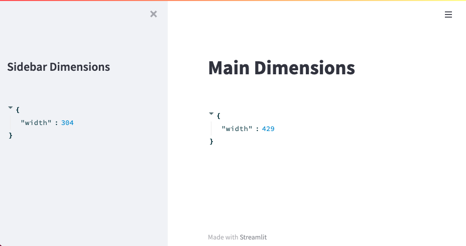

# Streamlit - Dimensions

A simple streamlit component that returns the dimensions of the container where it is rendered.
This may be used to format other components that require the dimensions of the container.

## Notes and Limitations

If multiple `st_dimensions` components will be used in the app, each component must be given a unique `key` value. Otherwise, the `key` argument is not required.

The current version only provides the width of the container in pixels.

## Installation
```shell script
pip install streamlit-dimensions
```

## Example

```python
import streamlit as st
from streamlit_dimensions import st_dimensions

st.set_page_config(layout="wide")

st.title("Main Dimensions")
st.write(st_dimensions(key="main"))

with st.sidebar:
    st.title("Sidebar Dimensions")
    st.write(st_dimensions(key="sidebar"))

```


